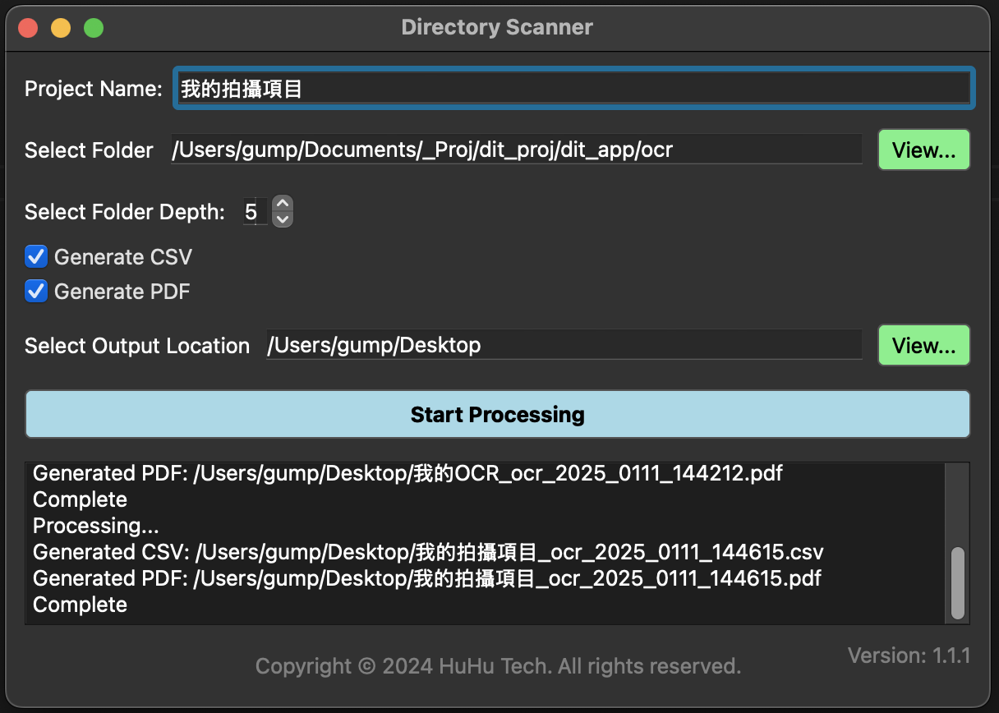
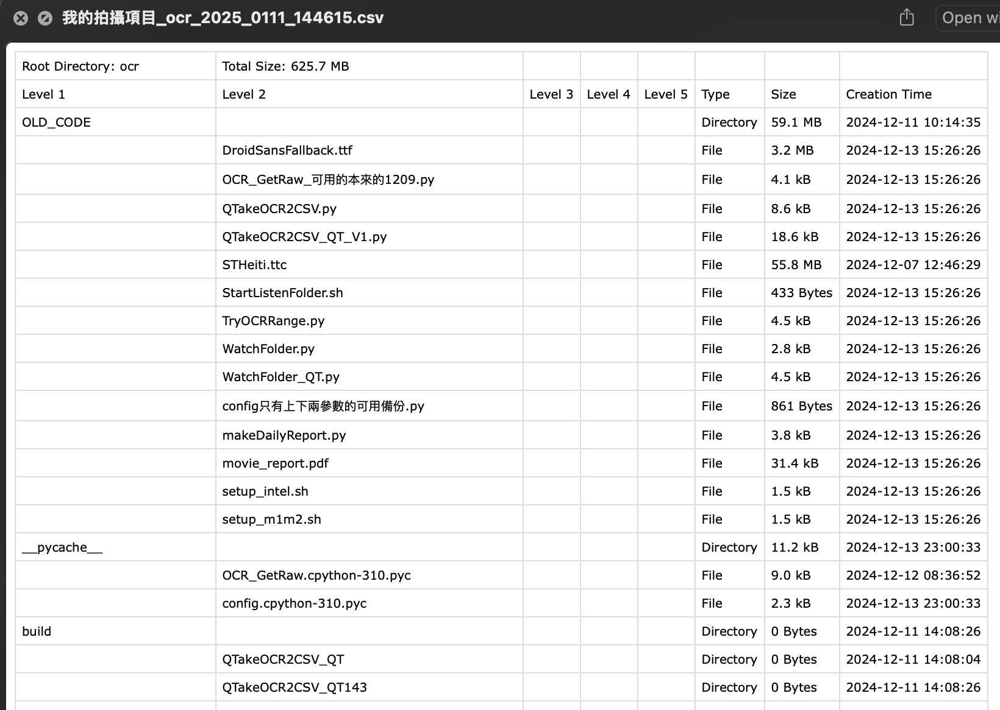
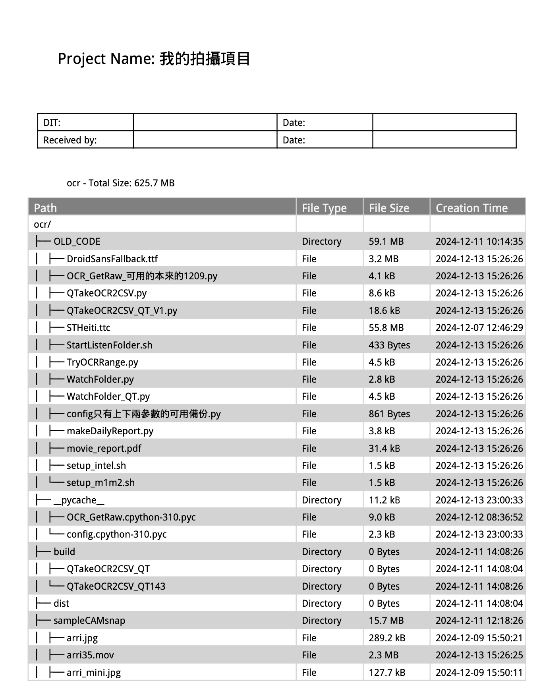

# 目錄掃描工具

## 功能描述
使用者選擇掃描目錄，輸出CSV 和 PDF 文件
CSV 輸出：
每一行代表一個文件或目錄
根據用戶指定的深度 n，創建 n 個層級的列
包含類型（文件/目錄）和大小信息 和建立日期
使用 humanize 庫來格式化文件大小

樹狀結構 PDF 輸出：
使用傳統的樹狀圖形字符顯示目錄結構
顯示每個文件和目錄的大小和建立日期

多國語支持 英文 繁體中文 簡體中文 預設使用系統語言 
翻譯依據 config.yaml 設定

## 下載
[Mac M Chip APP 下載](./Directory-Scanner-v1.1.1-M-Chip.dmg)

## 截圖

